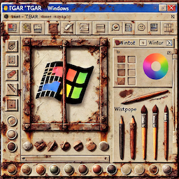

# tgar

This is the world's simplest way to write images from Rust in the TGA format.
It is one single file and has no dependencies.

If you are looking for a drop-dead simple way to write images to open in your image editor, and have a tab open on BMP and TIFF formats right now
trying to figure out which one you can emit using a `for` loop, this is the crate you are looking for.  TGA is a widely
supported but trivial file format.  This library supports BGRA 32-bit uncompressed images only, a popular and trivial subset.

I designed this library to dump GPU textures for debugging purposes, but it is suitable for a wide variety of applications.

